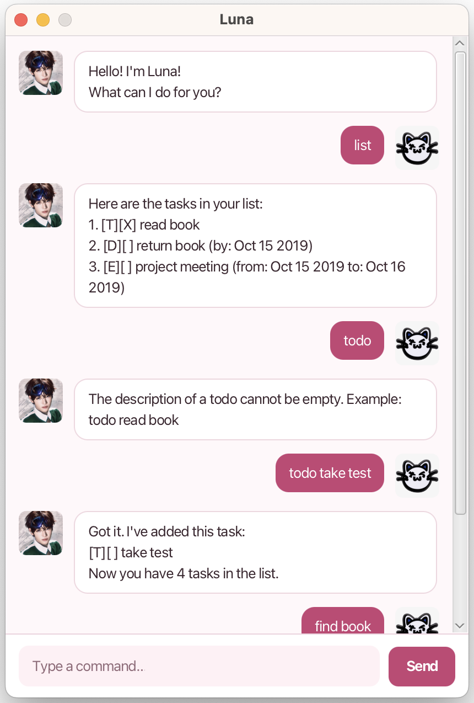

# Luna User Guide

<p align="center">
  
</p>

## Introduction

**Luna** is a desktop task-tracking chatbot that helps you manage your todos, deadlines, and events through simple text commands. Luna supports both full commands and short aliases for faster typing.

---

## Command Summary

| Action       | Command Format                   | Alias |
| ------------ | -------------------------------- | ----- |
| List tasks   | `list`                           | `ls`  |
| Add todo     | `todo DESC`                      | `t`   |
| Add deadline | `deadline DESC /by DATE`         | `d`   |
| Add event    | `event DESC /from START /to END` | `e`   |
| Mark task    | `mark INDEX`                     | `m`   |
| Unmark task  | `unmark INDEX`                   | `u`   |
| Delete task  | `delete INDEX`                   | `del` |
| Find tasks   | `find WORD`                      | `f`   |
| Exit Luna    | `bye`                            | `q`   |


---

## Notes

* Task numbers start from **1**.
* Commands are **case-insensitive**.
* Extra spaces are ignored.
* Invalid formats will show an error message explaining why.

---

## Features

### View all tasks

Shows the full task list.

Command:

```
list
```

Alias:

```
ls
```

Sample Output:

```
Here are the tasks in your list:
1. [T][ ] read book
2. [D][ ] submit report (by: Mar 01 2026)
```

---

### Add a Todo

Adds a simple task.

Command:

```
todo <description>
```

Example:

```
todo read book
```

Alias:

```
t read book
```

Sample Output:

```
Got it. I've added this task:
[T][ ] read book
Now you have 1 tasks in the list.
```

---

### Add a Deadline

Adds a task with an end date.

Command:

```
deadline <description> /by <date>
```

Example:

```
deadline submit report /by 2026-03-01
```

Alias:

```
d submit report /by 2026-03-01
```

Sample Output:

```
Got it. I've added this task:
[D][ ] submit report (by: Mar 01 2026)
Now you have 2 tasks in the list.
```

---

### Add an Event

Adds a task with a start and end date.

Command:

```
event <description> /from <startDate> /to <endDate>
```

Example:

```
event project meeting /from 2026-03-02 /to 2026-03-03
```

Alias:

```
e project meeting /from 2026-03-02 /to 2026-03-03
```

Sample Output:

```
Got it. I've added this task:
[E][ ] project meeting (from: Mar 02 2026 to: Mar 03 2026)
Now you have 3 tasks in the list.
```

---

### Mark a task as done

Marks the specified task as completed.

Command:

```
mark <task number>
```

Example:

```
mark 2
```

Alias:

```
m 2
```

Sample Output:

```
Nice! I've marked this task as done:
[D][X] submit report (by: Mar 01 2026)
```

---

### Unmark a task

Marks the task as not done.

Command:

```
unmark <task number>
```

Example:

```
unmark 2
```

Alias:

```
u 2
```

Sample Output:

```
OK, I've marked this task as not done yet:
[D][ ] submit report (by: Mar 01 2026)
```

---

### Delete a task

Removes a task from the list.

Command:

```
delete <task number>
```

Example:

```
delete 3
```

Alias:

```
del 3
```

Sample Output:

```
Noted. I've removed this task:
[E][ ] project meeting (from: Mar 02 2026 to: Mar 03 2026)
Now you have 2 tasks in the list.
```

---

### Find tasks

Searches for tasks containing a keyword.

Command:

```
find <keyword>
```

Example:

```
find book
```

Alias:

```
f book
```

Sample Output:

```
Here are the matching tasks in your list:
1. [T][ ] read book
```

---

### Exit Luna

Closes the application.

Command:

```
bye
```

Alias:

```
q
```

Sample Output:

```
Bye. Hope to see you again soon!
```
